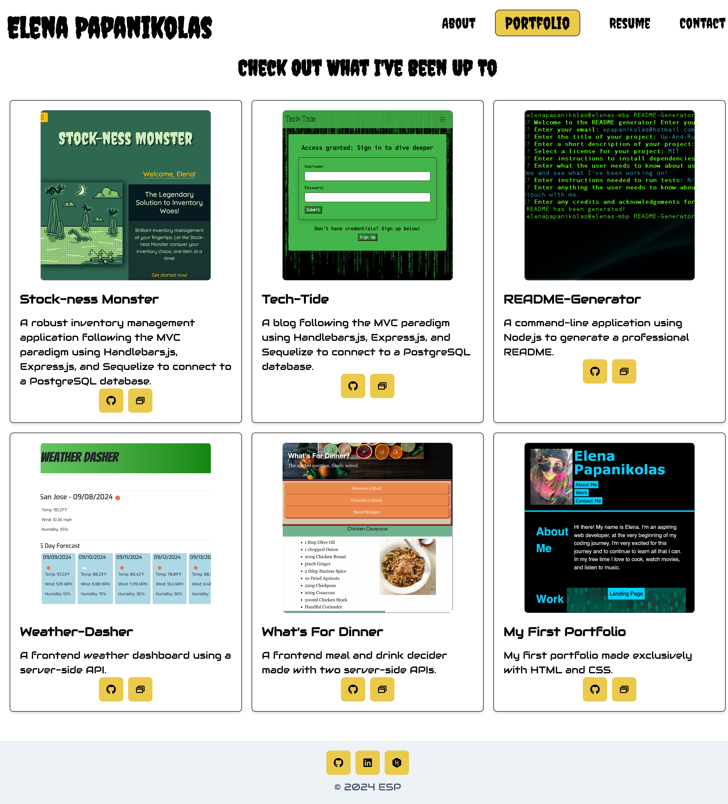

# Up-And-Running

## Description
Welcome to Up-And-Running, my developer portfolio made using React and Chakra UI. This is a single-page-application using the latest technologies. Up-And-Running features a bit about me, my resume, ways to contact me, and showcases some of my favorite projects.
## Table of Contents
* [Installation](#installation)
* [Usage](#usage)
* [License](#license)
* [Contributing](#contributing)
* [Credits](#credits)
* [Tests](#tests)
* [Questions](#questions)

## Installation
Installation instructions for application:
This application is deployed using Netlify. Please see the link below for the deployed application.

## Usage
Click [here](https://elena-papanikolas-portfolio.netlify.app/) to view the deployed application.

Check out my latest developer portfolio. To start, the About Me component is selected by default and tells a little bit about me and shows a current photo. The navigation links at the top of the page allow the user to view Portfolio, Resume, and Contact components. The Portfolio component showcases six of my favorite projects, with a short description and screenshot, and links to the corresponding GitHub repository and deployed application. The next Resume component lists my proficiencies and an image to view my resume quickly, and a Download Resume button to download my resume directly for your records. The last Contact component shows my contact information and a contact form to send me a message to get in contact with me. The footer shows icon links to my GitHub, LinkedIn, and Hackerrank profiles.

## License 
This project is operating under the MIT license. For more detailed information about the license, please click [here](https://opensource.org/licenses/MIT).

## Contributing 
See my contact information to get in touch with me.

## Credits
Icons by [icons8](https://icons8.com/icons).

## Tests
To run tests for the application:
N/A

## Questions 
Contact me with any questions regarding this project:

GitHub: [ElenaPapanikolas](https://github.com/ElenaPapanikolas)

Email: epapanikolas@hotmail.com

